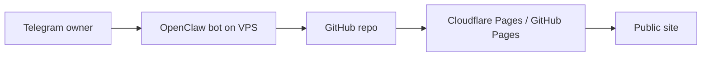

# Research Report: OpenClaw Telegram Blog Publishing Skill

Generated: 2026-05-13 16:44 +07

## Executive Summary

Best path: keep source-of-truth in GitHub, let the Telegram bot generate Markdown, validate, commit, push, and let Cloudflare Pages or GitHub Pages deploy. Do not run a CMS yet. Your repo is already markdown-first, Astro validates frontmatter, and `git push` is the deploy boundary.

Use VPS for the bot runtime because Telegram webhook needs HTTPS, secrets, and command execution. Cloudflare Pages is best for hosting this repo. GitHub Pages is viable, but needs GitHub Actions for Astro build. VPS-only deploy works, but adds ops and loses clean Git history unless you still push.

## Sources

- Telegram Bot API: webhooks send HTTPS POST updates; `secret_token` verifies Telegram-origin requests: https://core.telegram.org/bots/api
- GitHub REST Contents API: create/update repository files with contents write permission: https://docs.github.com/en/rest/repos/contents
- GitHub workflow dispatch API: trigger Actions workflow with Actions write permission: https://docs.github.com/en/rest/actions/workflows
- GitHub Pages publishing source: publish on branch push or via Actions workflow: https://docs.github.com/en/pages/getting-started-with-github-pages/configuring-a-publishing-source-for-your-github-pages-site
- Cloudflare Pages Deploy Hooks: POST unique hook URL to trigger deploy; protect URL as secret: https://developers.cloudflare.com/pages/configuration/deploy-hooks/

## Repo Contract

Post file:

```text
src/content/posts/{vi|en}/YYYY-MM-DD-slug.md
```

Frontmatter:

```yaml
---
title: "Post title"
date: 2026-05-13
tags: [tag1, tag2]
summary: "One paragraph hook for previews + OG."
draft: false
translationKey: optional-shared-key
---
```

Validation:

```bash
npm run check
npm run build
```

## Recommended Architecture



Flow:

1. Owner sends: `viết bài: <topic>` or `/post vi <topic>`.
2. Bot asks missing metadata: title, tags, publish/draft.
3. Bot generates Markdown in repo format.
4. Bot writes file to local repo clone or GitHub Contents API.
5. Bot runs `npm run check && npm run build`.
6. Bot commits and pushes to `main`, or creates branch/PR for review.
7. Hosting auto-deploys on push.
8. Bot replies with commit URL and public URL estimate.

## Option Comparison

| Option | Recommendation | Why |
|---|---:|---|
| VPS bot + local git push + Cloudflare Pages | Best | Simple, auditable, matches current repo |
| VPS bot + GitHub Contents API | Good | No local clone needed, but harder to validate before commit |
| Bot triggers GitHub Action only | Good for later | Cleaner permissions, but more moving parts |
| VPS builds and serves site directly | Not first | More ops: nginx, SSL, deploy rollback |
| Headless CMS + deploy hook | Overkill now | Adds data model and UI you do not need |

## Skill Shape For OpenClaw

Create a skill like `blog-publisher` with this behavior:

```markdown
name: blog-publisher
description: Create and publish Seandev blog posts from Telegram commands.

When user asks to write/publish a post:
1. Confirm requester chat_id is allowlisted.
2. Extract lang, topic, title, tags, summary, publish mode.
3. If missing info, ask one concise follow-up.
4. Generate Markdown matching Astro content schema.
5. Save to src/content/posts/{lang}/YYYY-MM-DD-{slug}.md.
6. Run npm run check and npm run build.
7. Commit with: post: add {slug}
8. Push to main only after explicit publish confirmation.
9. Reply with file path, commit hash, and expected URL.

Never publish drafts without confirmation.
Never expose tokens, env vars, deploy hook URLs, or file contents containing secrets.
```

## Security Rules

- Allowlist Telegram `chat_id`; reject everyone else.
- Use Telegram webhook `secret_token`; verify `X-Telegram-Bot-Api-Secret-Token`.
- Store secrets only on VPS env/secret manager: `TELEGRAM_BOT_TOKEN`, `GITHUB_TOKEN` or deploy key, deploy hook if used.
- Prefer a GitHub deploy key or fine-grained PAT limited to one repo.
- Default to `draft: true` until user says publish.
- Require explicit confirmation before direct push to `main`.
- Log actions, not prompt contents if posts may include private notes.

## Implementation Plan

Phase 1:

- Add skill/prompt config to OpenClaw.
- Add command parser: `/post`, `/draft`, `/publish-latest`.
- Add post generator with frontmatter schema.
- Use local repo clone on VPS.
- Run validation before commit.

Phase 2:

- Add preview workflow: branch + PR instead of direct main.
- Add deploy status polling.
- Add image/asset handling.
- Add bilingual translation flow with shared `translationKey`.

## Minimal VPS Setup

```bash
git clone git@github.com:OWNER/seanblog.git /srv/seanblog
cd /srv/seanblog
npm ci
npm run check
npm run build
```

Bot publish command should do:

```bash
git pull --ff-only
# write src/content/posts/vi/YYYY-MM-DD-slug.md
npm run check
npm run build
git add src/content/posts/vi/YYYY-MM-DD-slug.md
git commit -m "post: add slug"
git push origin main
```

## Unresolved Questions

- OpenClaw skill format/API exact path unknown.
- Current hosting final choice: Cloudflare Pages, GitHub Pages, or VPS.
- Direct publish to `main` vs PR review.
